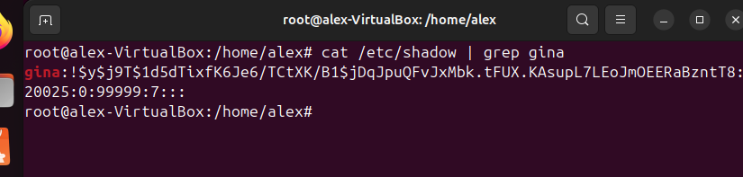
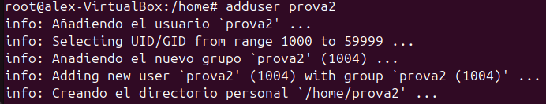
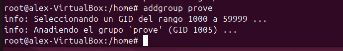
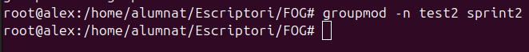
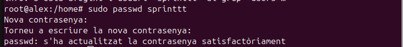
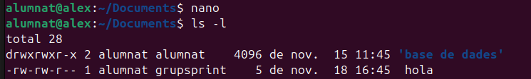
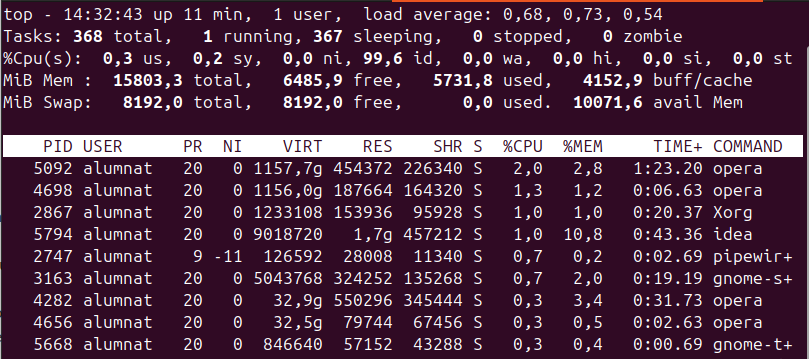
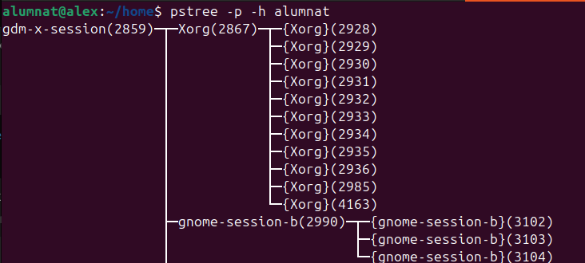
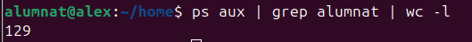
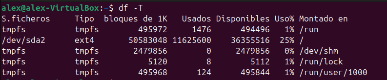

# Sprint2
## GESTIÓ D'USUARIS I GRUPS:
A Ubuntu, els usuaris i grups són essencials per gestionar els permisos i l'accés als recursos del sistema. Els usuaris compten  cadascun amb el seu espai i configuració, mentre que els grups agrupen usuaris amb permisos similars per facilitar la gestió. Això permet controlar qui pot accedir o modificar certs fitxers o directoris.

###Directoris

1--/etc/shadow
    
Guarda informacio de les contrasenyes dels usuaris en format xifrat i altres paràmetres de seguretat(expiració de la contrasenya...)
El segon camp pot conteni * que significa que el compte esta totalment desavilitat o ! indica que està deshabilitat per accedir-hi amb contrasenya.
Tambe es important saber que el camp "epoch"  representa la data de l'últim canvi de contrasenya de l'usuari.

2--/etc/passwd

Conté la llista d’usuaris del sistema, el nom d’usuari, l’ID d’usuari (UID), l’ID de grup (GID), la carpeta personal i el shell per defecte...

3--/etc/gshadow

Emmagatzema informació xifrada sobre els grups i les seves contrasenyes, així com els administradors de cada grup i els usuaris amb accés al grup.

4--/etc/grup

Inclou la llista de grups del sistema amb el nom de cada grup, l'ID de grup (GID) i els usuaris que en formen part.

###Comandes bàsiques

###Creació d'usuaris
Les maneres més comunes de crear usuaris en Ubuntu són: (adduser, adduser)
adduser te fa una sèrie de preguntes inicials i user add no .

Per a elimina un usuari usem deluser podem usa sudo deluser --remove-home (usuari) para elimina tame el directori personal 

###Creació de grups

Per a crear un grup he usat addgroup

I per a eliminarlo delgroup

###Modificasio

Crearem un altre grup

I li cambiarem lo nom a test2 en la comanda:

Una altra modificació seria canvia la contrasenya amb passwd

Ara assigno l'usuari pere com a administrador del grup jocs amb gpasswd. Després, afegeixo sprinttt al grup jocs amb usermod. Finalment, verifico que sprinttt és al grup /etc/group amb grep

#Verificacio
Comprovarem el canvi de nom:

#Paraules de pas als grup

##GESTIÓ DE PERMISOS
###Permisos normals
###Umask
###Permisos especials

###ACLs
Esta comanda modifica els permisos ACL (Access Control List) que lleva tots els permisos a l'usuari prova3 al directori prova.

La comanda getfacl que es fa servir per consultar els permisos ACL

##GESTIÓ DE PROCESSOS

1. top  
Mostra en temps real els processos en execució, el seu consum de CPU, memòria, i altres detalls del sistema.(monitoritzar l'estat general del sistema)

2. pstree -p -h alumnat:  
Mostra els processos en forma d'arbre jeràrquic.
-p: Inclou els identificadors dels processos (PIDs).
-h: Ressalta el procés en execució actual.

3. ps aux | grep profe | wc -l:  
ps aux: Llista tots els processos del sistema.
grep profe: Filtra els processos que contenen "profe".
wc -l: Compta el nombre tel nombre de processos relacionats amb profe.

4. fg %1:  
Porta un procés aturat (en segon pla) al primer pla. 
%1 és el número del treball que es vol restaurar.

5.kill -9 05574:  
Mata un procés de manera immediata.
-9:Forçar la terminació del procés amb el PID 05574.

6.jobs:  
Llista els processos aturats o en segon pla.

##Teoria de Prioritat dels processos
Els processos tenen prioritats que van del -20 (màxima prioritat) al 19 (mínima prioritat).
Per defecte, la prioritat és 0.

7.renice -n -19 -p 10099:  
Modifica la prioritat d'un procés existent.
Exemple: renice -n -19 -p 1234 ajusta el procés amb PID 1234 a la màxima prioritat (-19).

#Gestio de memoria

