# Sprint2
## GESTIÓ D'USUARIS I GRUPS:
A Ubuntu, els usuaris i grups són essencials per gestionar els permisos i l'accés als recursos del sistema. Els usuaris compten  cadascun amb el seu espai i configuració, mentre que els grups agrupen usuaris amb permisos similars per facilitar la gestió. Això permet controlar qui pot accedir o modificar certs fitxers o directoris.

###Directoris

1--/etc/shadow
    
Guarda informacio de les contrasenyes dels usuaris en format xifrat i altres paràmetres de seguretat(expiració de la contrasenya...)
El segon camp pot conteni * que significa que el compte esta totalment desavilitat o ! indica que està deshabilitat per accedir-hi amb contrasenya.
Tambe es important saber que el camp "epoch"  representa la data de l'últim canvi de contrasenya de l'usuari.

2--/etc/passwd

Conté la llista d’usuaris del sistema, el nom d’usuari, l’ID d’usuari (UID), l’ID de grup (GID), la carpeta personal i el shell per defecte...

3--/etc/gshadow

Emmagatzema informació xifrada sobre els grups i les seves contrasenyes, així com els administradors de cada grup i els usuaris amb accés al grup.

4--/etc/grup

Inclou la llista de grups del sistema amb el nom de cada grup, l'ID de grup (GID) i els usuaris que en formen part.

###Comandes bàsiques

###Creació d'usuaris
Les maneres més comunes de crear usuaris en Ubuntu són: (adduser, adduser)
adduser te fa una sèrie de preguntes inicials i user add no .
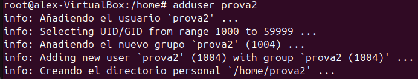

Per a elimina un usuari usem deluser podem usa sudo deluser --remove-home (usuari) para elimina tame el directori personal 
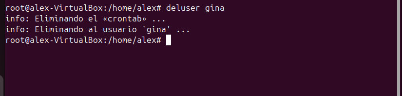
###Creació de grups

Per a crear un grup he usat addgroup

I per a eliminarlo delgroup

###Modificasio

Crearem un altre grup
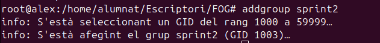

I li cambiarem lo nom a test2 en la comanda:
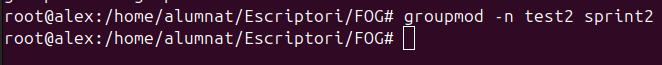

Una altra modificació seria canvia la contrasenya amb passwd

Ara assigno l'usuari pere com a administrador del grup jocs amb gpasswd. Després, afegeixo sprinttt al grup jocs amb usermod. Finalment, verifico que sprinttt és al grup /etc/group amb grep
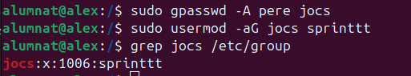
###Verificacio
Comprovarem el canvi de nom:
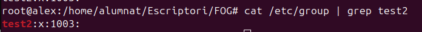

###Paraules de pas als grup
He canviat la contrasenya del grup grupsprint utilitzant gpasswd i després m'he unit al grup amb newgrp.
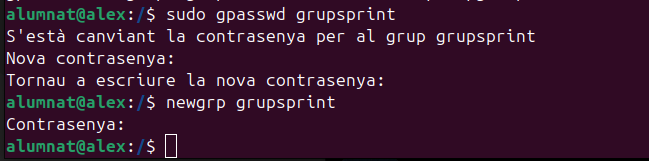

##GESTIÓ DE PERMISOS
###Permisos normals
He creat el fitxer ex1.txt i ja existia ex2.txt. Després he comprovat els permisos inicials.
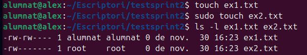

He canviat els permisos de ex1.txt a 640 per donar només lectura i escriptura a l'usuari i lectura al grup.
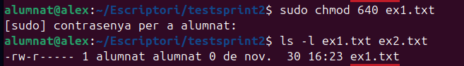

He afegit permisos d'execució per al grup (g+x) al fitxer ex1.txt.
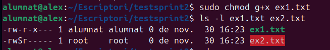

Finalent he aplicat permisos d'execució de manera recursiva a tots els fitxers dins de la carpeta testsprint2.
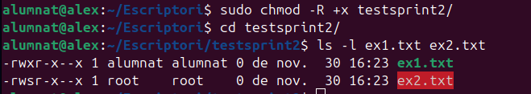

###Umask
Umask defineix els permisos per defecte dels fitxers i directoris que es creen.

1. Canviar la màscara temporalment  

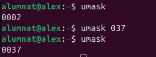

2. Modificar la màscara global  
Per establir un valor de umask que s'apliqui a tots els usuaris:  
Editar /etc/login.defs:

Comprovasio: Reiniciem la maquina  
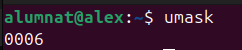
###Permisos especials

###ACLs
Esta comanda modifica els permisos ACL (Access Control List) que lleva tots els permisos a l'usuari prova3 al directori prova.

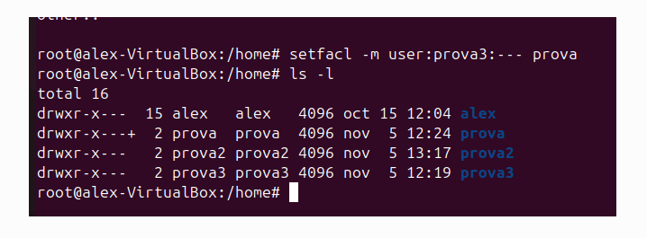

La comanda getfacl que es fa servir per consultar els permisos ACL
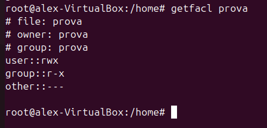

##GESTIÓ DE PROCESSOS

1. top  
Mostra en temps real els processos en execució, el seu consum de CPU, memòria, i altres detalls del sistema.(monitoritzar l'estat general del sistema)
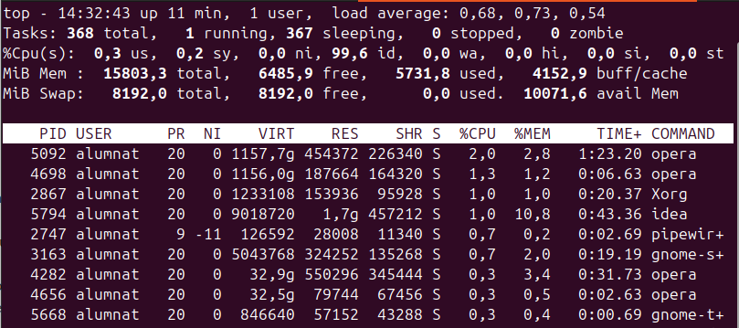

2. pstree -p -h alumnat:  
Mostra els processos en forma d'arbre jeràrquic.
-p: Inclou els identificadors dels processos (PIDs).
-h: Ressalta el procés en execució actual.
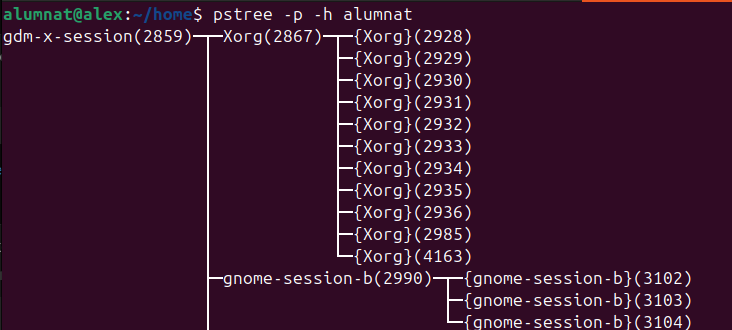

3. ps aux | grep profe | wc -l:  
ps aux: Llista tots els processos del sistema.
grep profe: Filtra els processos que contenen "profe".
wc -l: Compta el nombre tel nombre de processos relacionats amb profe.

4. fg %1:  
Porta un procés aturat (en segon pla) al primer pla. 
%1 és el número del treball que es vol restaurar.

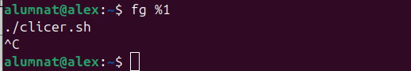

5.kill -9 05574:  
Mata un procés de manera immediata.
-9:Forçar la terminació del procés amb el PID 05574.

6.jobs:  
Llista els processos aturats o en segon pla.
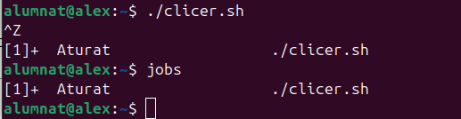

###Teoria de Prioritat dels processos
Els processos tenen prioritats que van del -20 (màxima prioritat) al 19 (mínima prioritat).
Per defecte, la prioritat és 0.

7.renice -n -19 -p 10099:  
Modifica la prioritat d'un procés existent.
Exemple: renice -n -19 -p 1234 ajusta el procés amb PID 1234 a la màxima prioritat (-19).
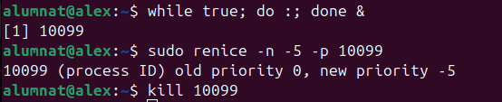

###Gestio de memoria

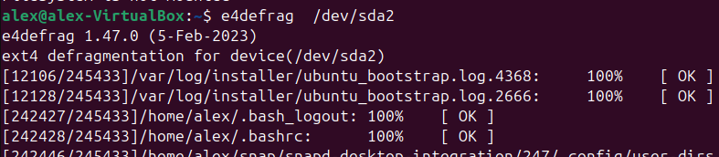  

## PARTICIONS
Primer usarem fdisk -l que llista els discos disponibles al sistema.
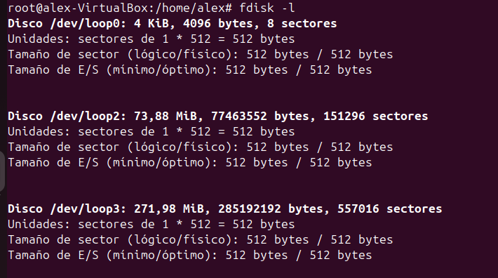

Farem una partició mbr amb les opcions per defecte
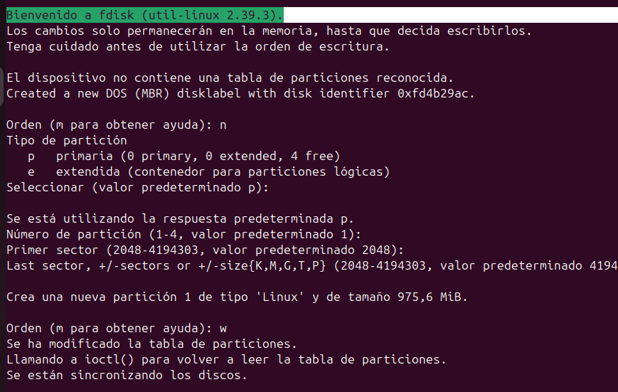

Utilitzarem mkfs.ext4 per crear un sistema de fitxers EXT4 al dispositiu /dev/sdb1
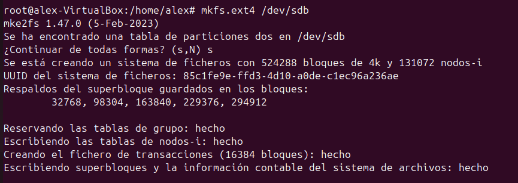

Amb tune2fs -l, es mostra el nombre de blocs (524288), mida per bloc (4096 bytes) i blocs per grup (32768).
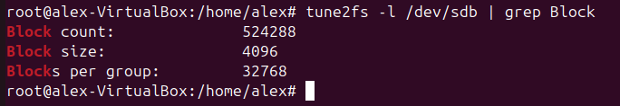

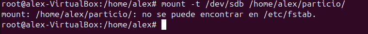

Afegirem una linia per munta automaticamt /dev/sdb1  
Els 0 al final signifiquen que no estarà inclòs en les còpies de seguretat (penúltim) i que no es comprovarà a l'arrancada (últim).
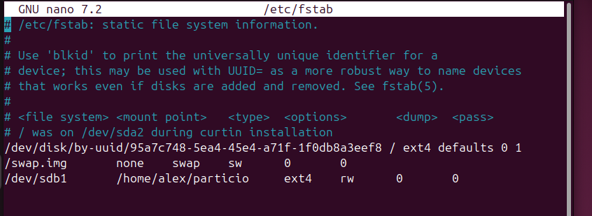

##COMPARTIR CARPETES
Per a compartir en samba necessitarem insta-la samba nautilus-share.
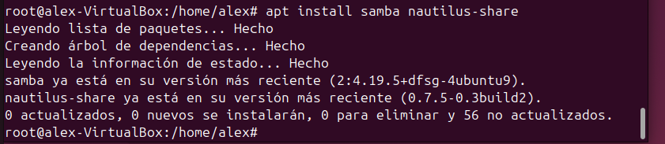

Podem fer-ho per interfície però sol dona errors i així que u farem per terminal.
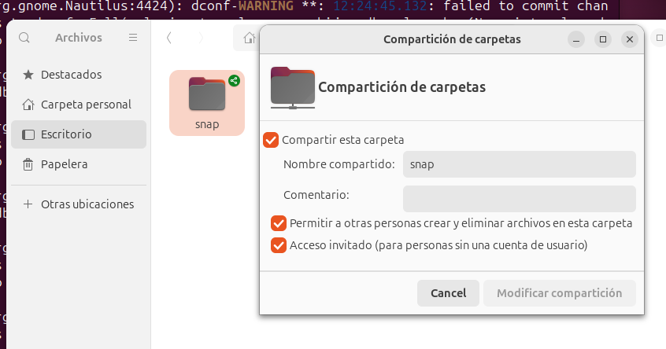

Configurem el fitxe /etc/samba/smb.conf per a compartir la carpeta partició1.
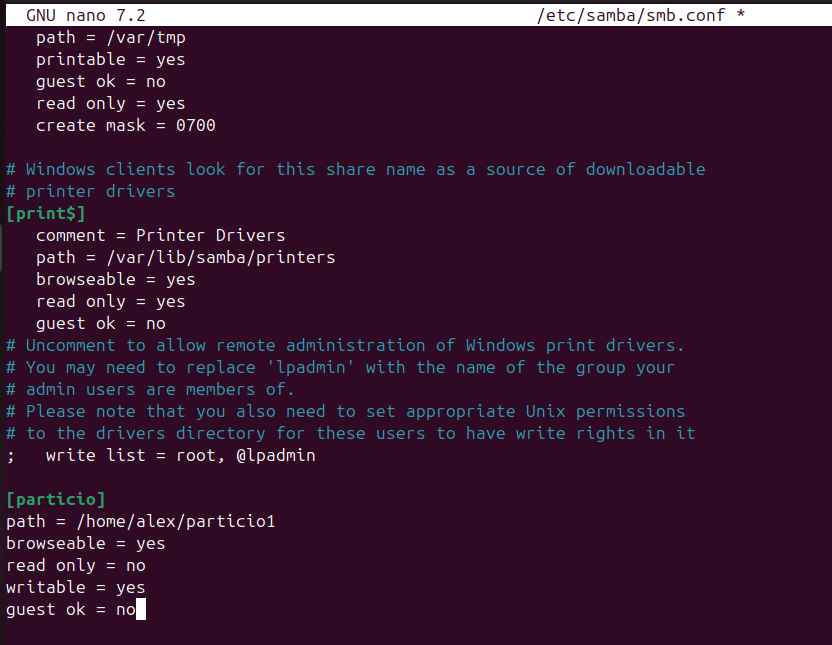

Comprovarem que el servei està en funcionament i que no dona errors usant la comanda systemctl status smbd
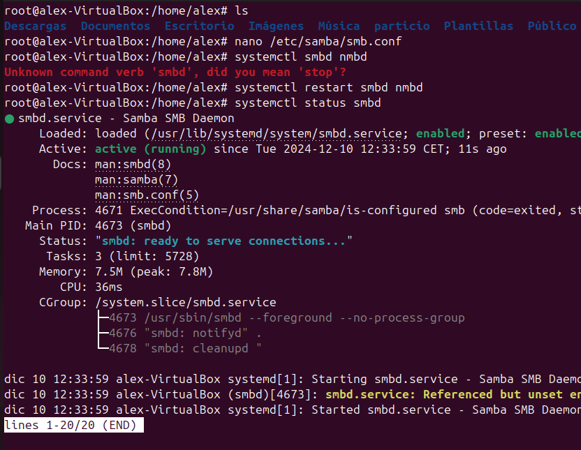

Crearem un usuari de prova 
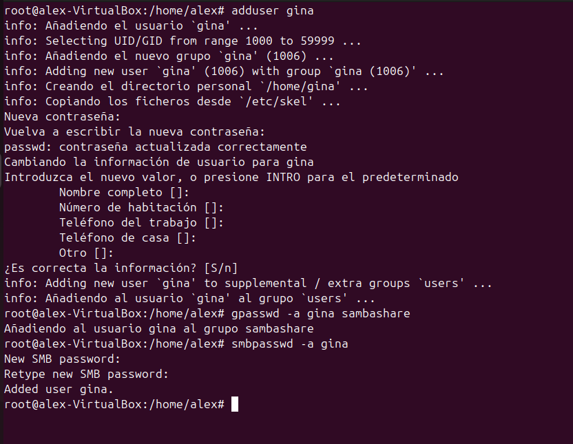

###Client

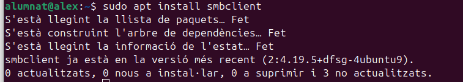

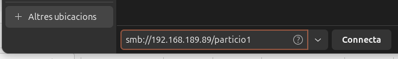

##COPIES DE SEGURETAT
###Conceptes teòrics

Establir una bona política de còpies de seguretat  

- **Completes** (Sempre que pugueu, una completa és el millor)
  - **Avantatges**:
    - Per a restaurar una còpia completa només cal la última completa.
  - **Desavantatges**:
    - Ocupa més espai.

- **Diferencials**: Fa una còpia de la diferència en l'última còpia completa per anar actualitzant.
  - **Avantatges**:
    - Ocupa menys espai.
  - **Desavantatges**:
    - Per a restaurar necessites la última completa i la última diferencial.

- **Incrementals**
  - **Avantatges**:
    - Ocupa encara menys espai.
  - **Desavantatges**:
    - Per a restaurar necessites la última completa, la última diferencial i totes les incrementals.

###Programes en interficie
He triat el programa de còpies Deja Dup  
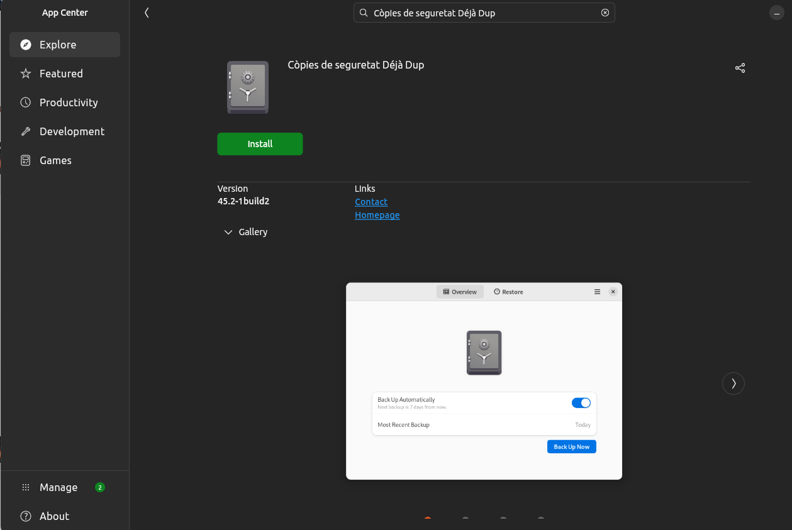  

És molt senzill d'utilitza triarem usuari i excepcions  
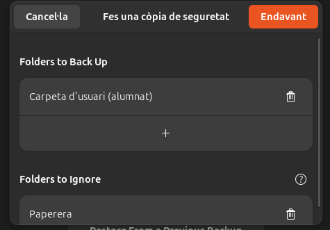  

Seleccionem on la volem guarda (local, Google Drive, OneDrive... ) ió he triat Google Drive.  
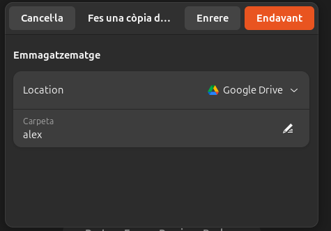

Per a una major seguretat podem posar una contrasenya
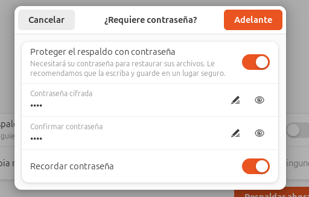

Aquí podem veure la còpia la data i tenim l'opció de restaurar o de visualitzar.
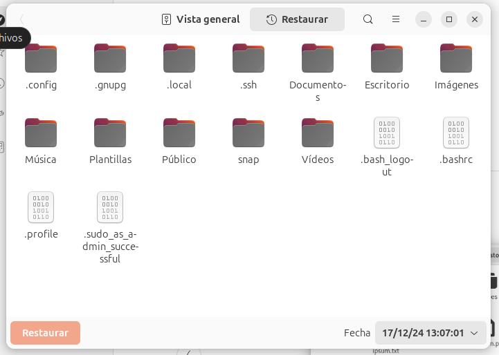

###Comandes
| Comanda | Funció principal                     | Ús comú                                    | Exemple d'ús                                  |
|---------|--------------------------------------|--------------------------------------------|-----------------------------------------------|
| `cp`    | Es una copiar fitxers o directoris          | Copiar fitxers en local             | `cp origen destí`                             |
| `rsync` | Sincronitzar fitxers i directoris    | Sincronitzar dades locals o remotes        | `rsync -av origen destí`                      |
| `dd`    | Copiar i convertir dades a baix nivell | Crear imatges de discos o còpies binàries | `dd if=origen of=destí bs=blocksize`          |

cp: es una copia simple no inteligen que no mira res i es fa en local

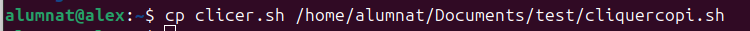  

rsync: és una còpia intel·ligent que només còpia els modificats i es pot fer en màquines remotes via SSH. 
  

dd: no és pròpiament per fe còpies d'arxius, treballa en local, treballa a escala de bloc. S'utilitza molt per a clonació de discos i particions.  
També la podem usar per esborrar millor els arxius
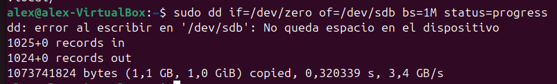

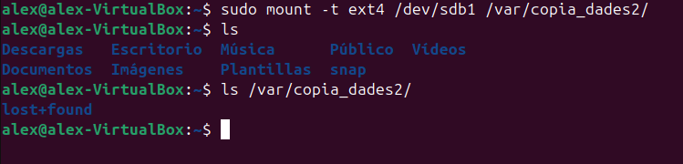

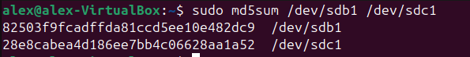

###Automatitsacio

####Cron
####Ancron

