# Sprint 3

## Instalacio LDAP
###Preparatius
Ubuntu 24 (sebidor)  
Tot servidor té per a tindre la IP fitxa aniria bé configura netplan però para passa del pas u farem en interfície
  

/etc/hostname: Defineix el nom del sistema com "alexcaballe".
  

/etc/hosts: Assigna noms de domini a IPs locals(Aquesta configuració permet resoldre el nom de l'equip sense necessitat de DNS extern.)

Per a fer la base del nostre domini tenim dos opcion o feru pels arxius base o a través de una comanda natros u farem per comanda  

Aquí veurem la configuració que he aplicat al servidor LDAP.

  

En aquesta comanda veurem el contingut actual
  

## Gestió d’usuaris i grups

Usarem els fitxes prefets pera a crear els grups i usuaris

En les següents dues captures adapto els fitxes al meu domini

  

- `-c`: Continua el procés encara que hi hagi errors.  
- `-x`: Utilitza autenticació simple (no SASL).  
- `-D`: Especifica el DN de l'usuari administrador.  
- `-W`: Demana la contrasenya de manera interactiva.  
- `-f`: Indica el fitxer LDIF amb les dades a afegir.  

I aquí un apartat posterior a la configuració

## Unir equips al domini

Instal·lació de nscd

###Configuració de ldap-auth-config  

Posarem la IP del servidor LDAP.

Proporcionarem el nom del domini

I la quenta que usarem

Instal·larem aquest paquet para que el sistema Linux s'autentifique mediant-te un servidor LDAP

Si lo client no se valida sa de fe un reconfigure del paquet anterior

Com podem veure al final hem aconseguit connecta el client al servidor LDAP amb l'usuari creat anteriorment  

##Entorns grafics
En el meu cas he triat  LDAP Account Manager (LAM) que és una eina web per gestionar usuaris, grups i permisos en servidors LDAP de manera fàcil i visual.  

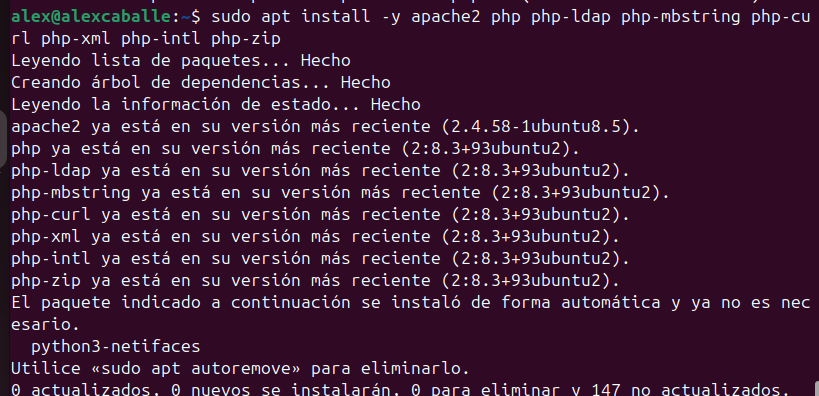

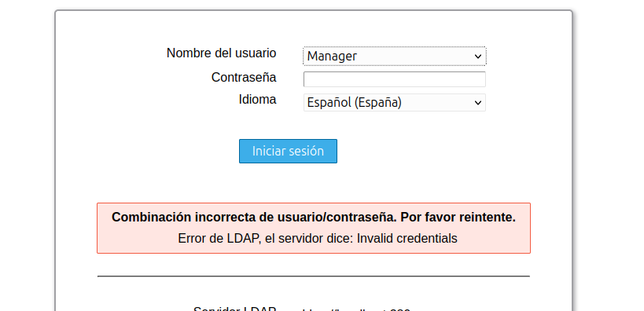

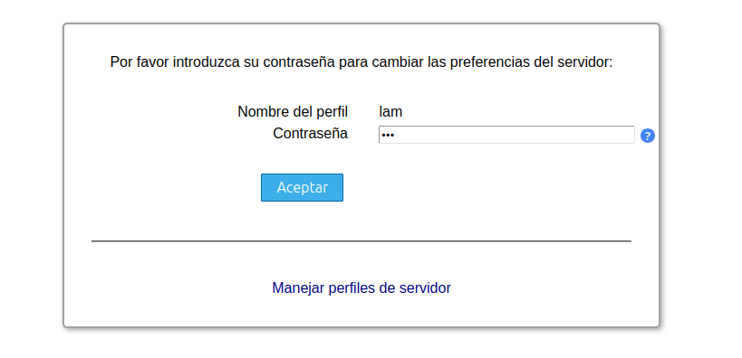

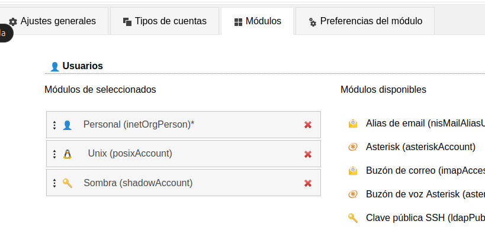

## Recursos en xarxa

Els servidors **Samba** i **NFS** serveixen per a compartir recursos en xarxa.

- El servidor **NFS** autentica a nivell de **màquina (host)** i no d'usuari.
- Permetre autenticació a nivell d'usuari amb **NFS** és complex i requereix **Kerberos**.
- Per aquest motiu, és més fàcil utilitzar **Samba** si es vol control d’accés per usuari.

### Servidor SAMBA
####Teoria:
El servidor Samba, a diferència del servidor NFS, permet l'autenticació a nivell d'usuari.
Permet la compartició de recursos que no són només carpetes, sinó també impressores.
Samba pot treballar conjuntament amb LDAP per utilitzar autenticació a nivell d'usuaris.
Samba permet la connexió de clients tant de Linux com de Windows.

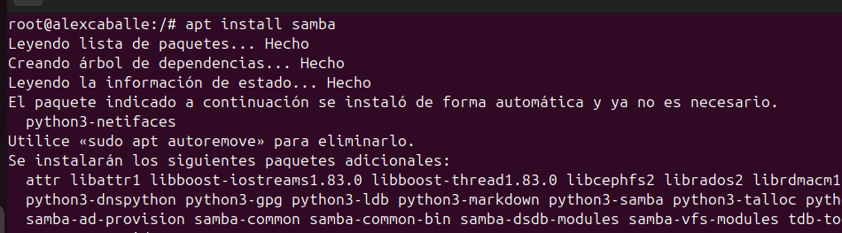

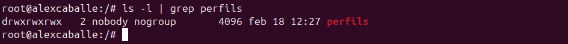

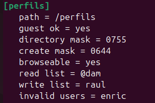

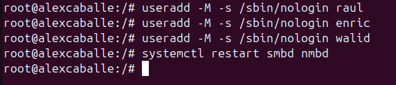

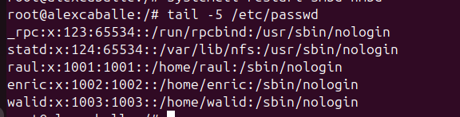

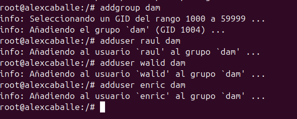

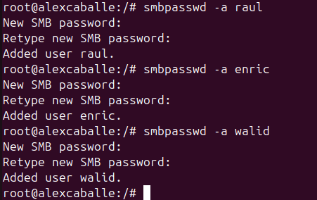

Client:

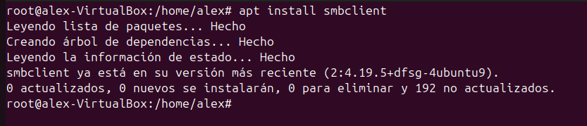

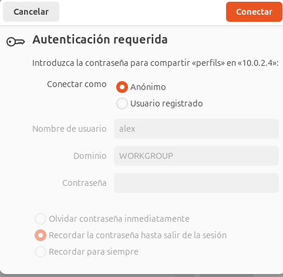

Raul crea

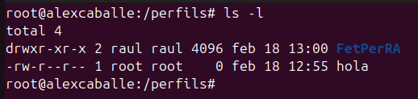

Enric no crea

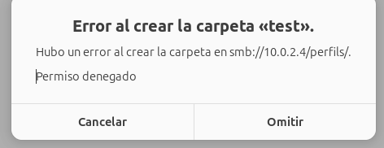

###Servidor NFS

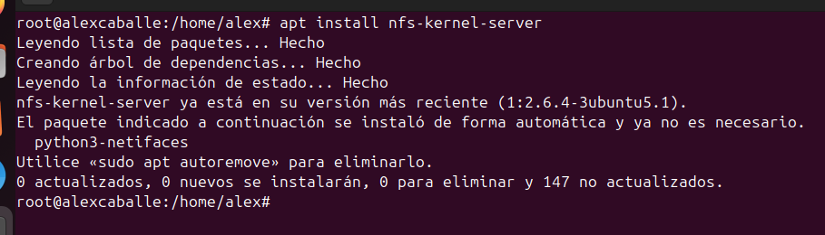

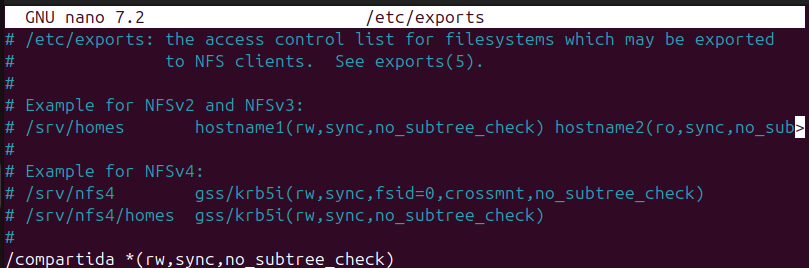

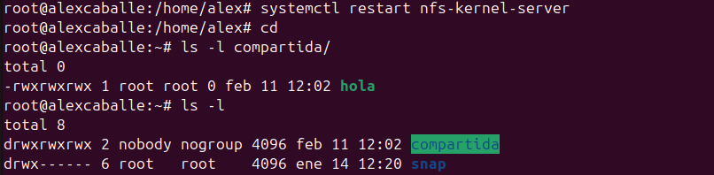

Client Windous

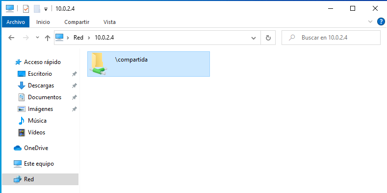

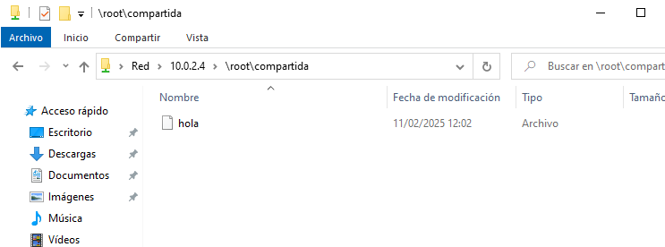

Client Ubuntu  
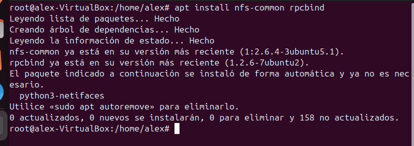

####Perfils mòbils

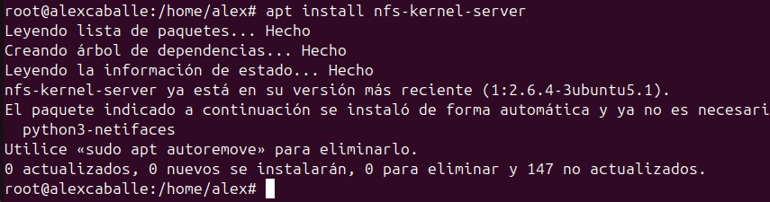

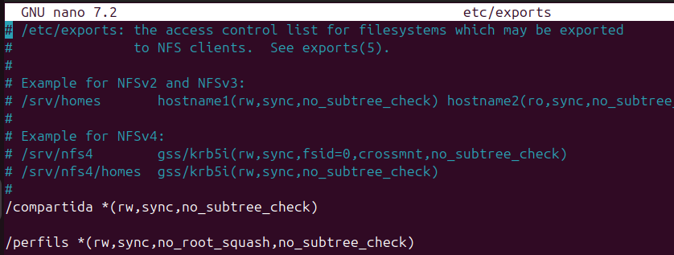

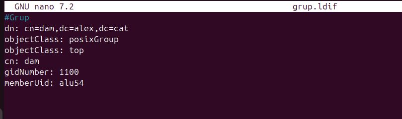

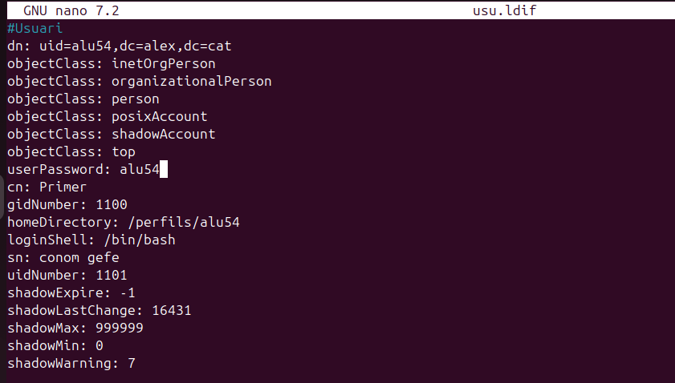

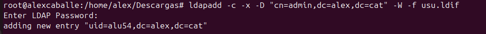

Client:

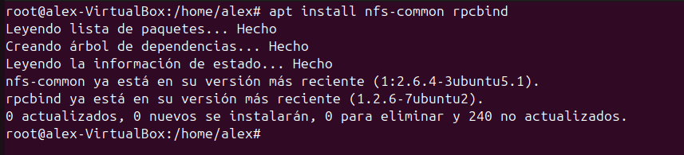

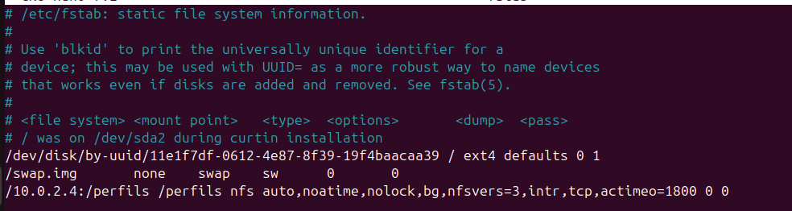

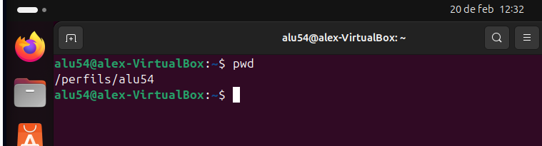

