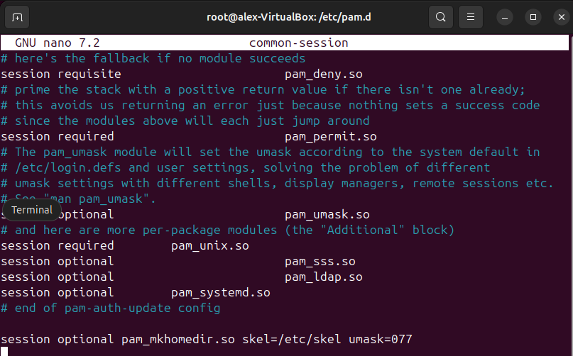

# Sprint 3S

## Instalacio LDAP
###Preparatius
Ubuntu 24 (sebidor)  
Tot servidor té per a tindre la IP fitxa aniria bé configura netplan però para passa del pas u farem en interfície
  

/etc/hostname: Defineix el nom del sistema com "alexcaballe".
  

/etc/hosts: Assigna noms de domini a IPs locals(Aquesta configuració permet resoldre el nom de l'equip sense necessitat de DNS extern.)

Per a fer la base del nostre domini tenim dos opcion o feru pels arxius base o a través de una comanda natros u farem per comanda  

Aquí veurem la configuració que he aplicat al servidor LDAP.

  

En aquesta comanda veurem el contingut actual
  

  

- `-c`: Continua el procés encara que hi hagi errors.  
- `-x`: Utilitza autenticació simple (no SASL).  
- `-D`: Especifica el DN de l'usuari administrador.  
- `-W`: Demana la contrasenya de manera interactiva.  
- `-f`: Indica el fitxer LDIF amb les dades a afegir.  

Client+------------------------------------------

Si lo client no se valida sa de fe un reconfigure del paquet anterior

## Gestió d’usuaris 

## Unir equips al domini

## Servidor SAMBA

##Servidor NFS

