# Sprint 4 
##Monotiratzacio  conexio remota

Veurem el contingut del directori /var/log/, amb diversos fitxers de registre del sistema.
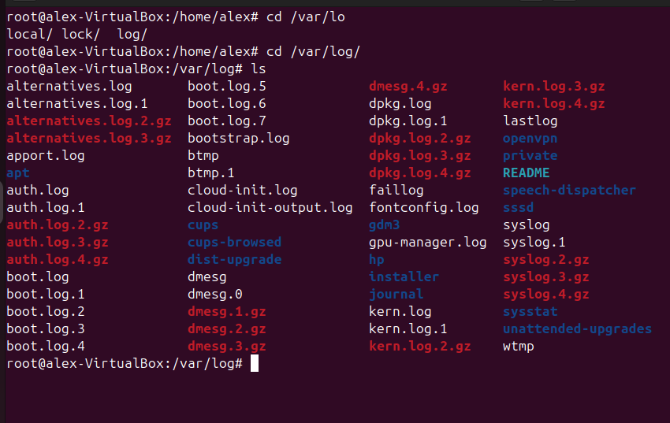

Editarem el fitxe etc/logrotate.conf, que defineix polítiques
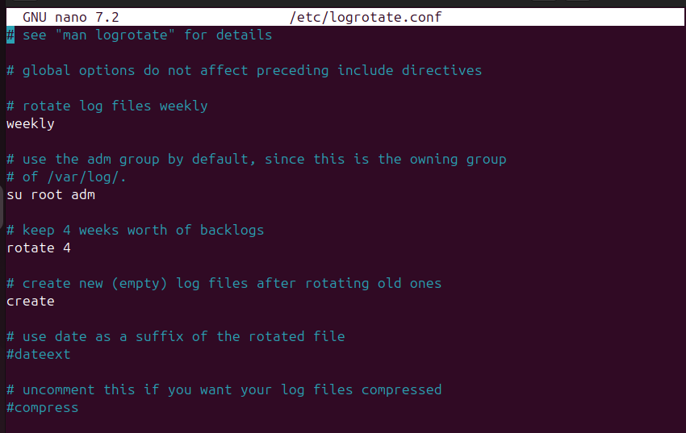

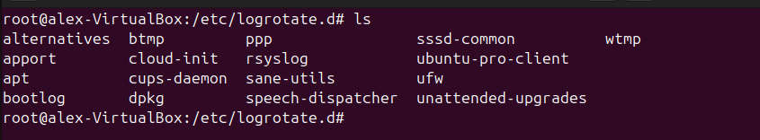

Enviament d'un missatge de registre amb logger
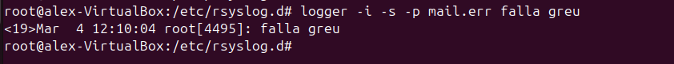

La verificació del log /var/log/mail.log
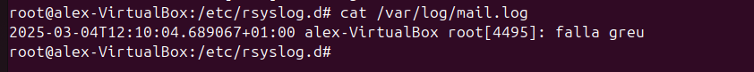

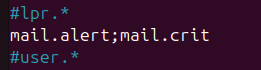
##Administració Remota (TEAM VIEWER, VNC)
###Team Viwer
Instal·lació a través de la pàgina web
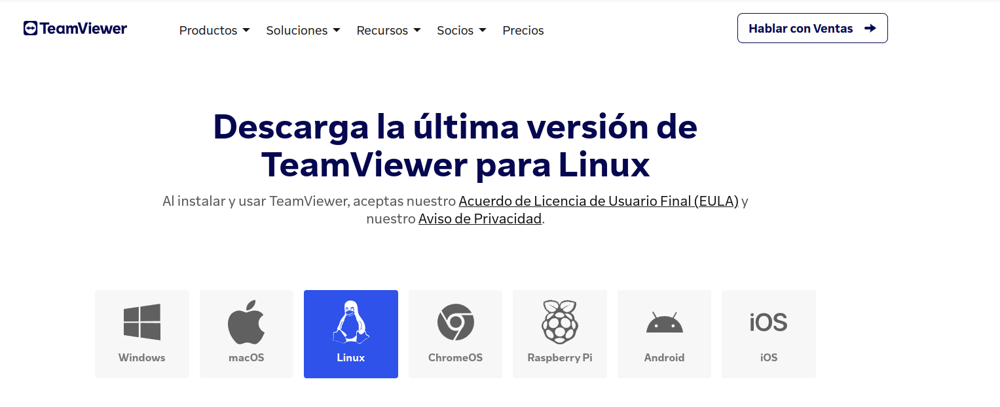
ID i contrasenya (Cal iniciar sessió en el controlador)
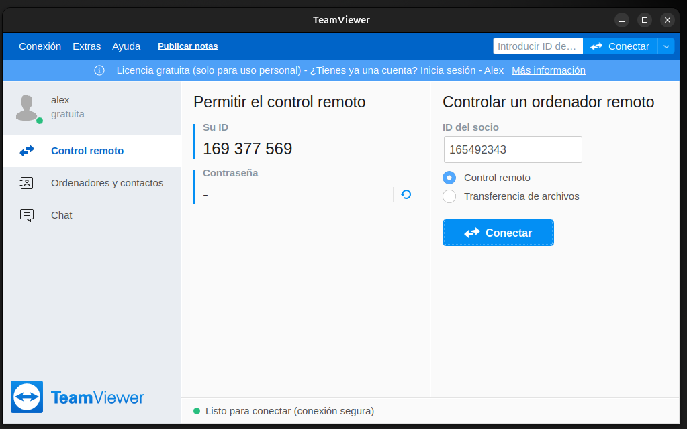
Poso la contrasenya del ordenador remot
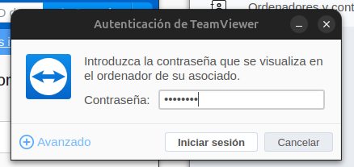
En el cas d'Ubuntu cada vegada que em connecto he de donar permís d'interacció remota
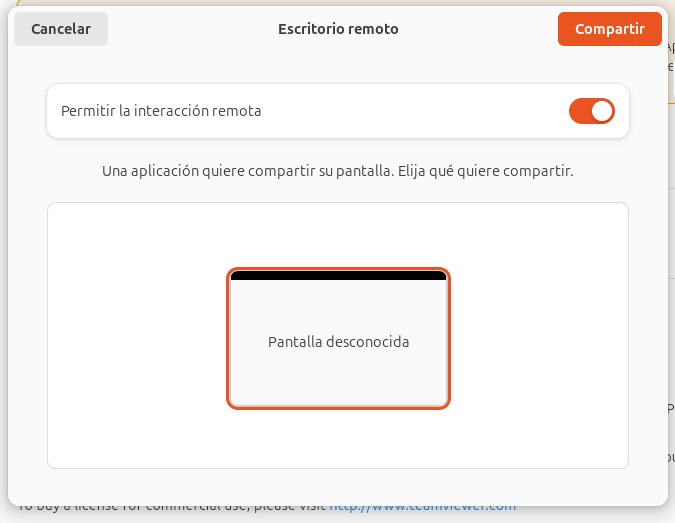
I finalment ja funciona se'n capaços de controlar el ordinador remot
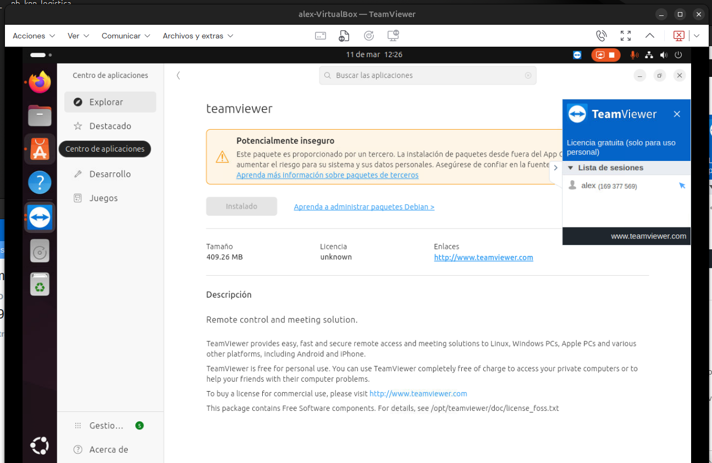

##Llicenciament 
Tipus de llicències  
Les llicències de programari defineixen com es pot utilitzar, modificar i redistribuir el codi. 

### GPL (General Public License)  
Llicència Pública General. Garanteix que el programari romangui lliure i qualsevol modificació també s’hagi de compartir amb la mateixa llicència.

### LGPL (Lesser General Public License)  
Llicència Pública General Menor. Similar a la GPL, però permet que llibreries lliures s’utilitzin en programari privatiu.

### MPL (Mozilla Public License)  
Llicència Pública de Mozilla. Llicència híbrida que permet combinar codi lliure amb propietari, però exigeix que les modificacions del codi original segueixin sent lliures.

### BSD (Berkeley Software Distribution)  
Distribució de Programari de Berkeley. Llicència permissiva que permet utilitzar el codi en projectes privats sense obligacions de compartir les modificacions.

### Domini Públic  
El programari és lliure de drets d'autor i es pot utilitzar, modificar i redistribuir sense restriccions.

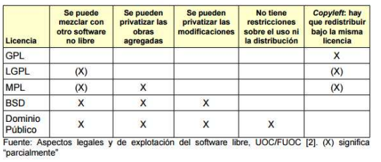

En el meu cas si estigues fent un projecte a nibell estudi i millora triaria BSD perquè ofereix màxima llibertat: permet reutilitzar el codi sense obligacions, fins i tot en programari privatiu. Això facilita la seva adopció per empreses i desenvolupadors. A més, només requereix crèdit a l’autor.

