# Sprint5
##Instalacions
###Windous Server

Per escomença seleccionarem l'idioma  

I començarem amb la instal·lació  
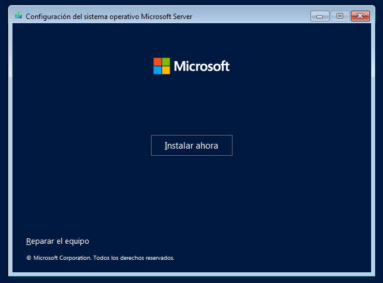

En el meu cas he triat la versió amb interfície gràfica  
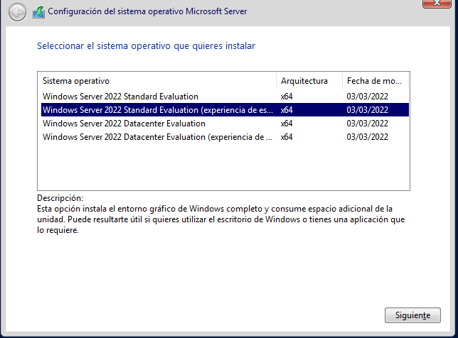

He fet les particions manualment i he creat una partició per al futur  
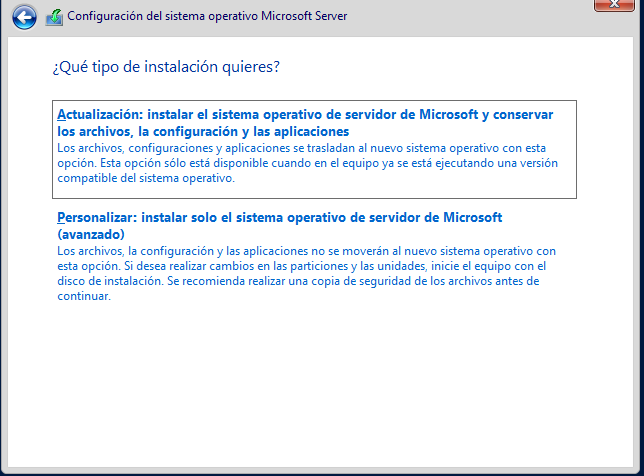

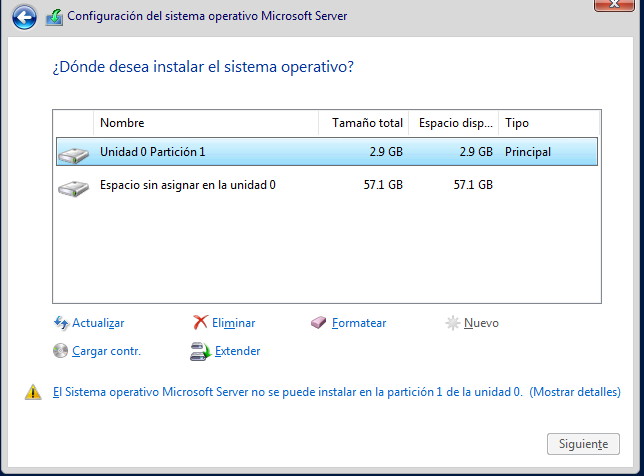

Ara toca espera asta que es completi la instal·lació  
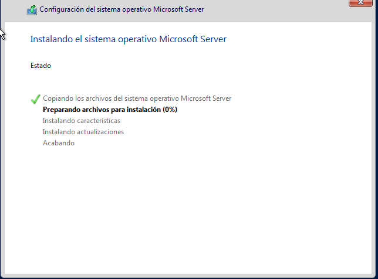

Per finalista configurarem l'usuari administrador  
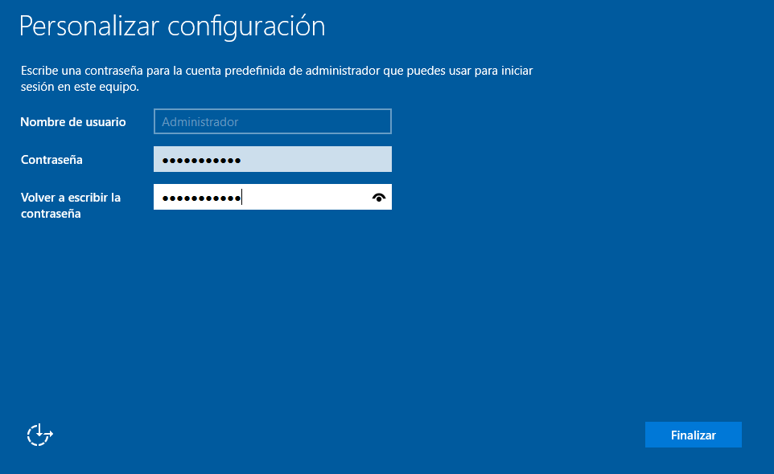

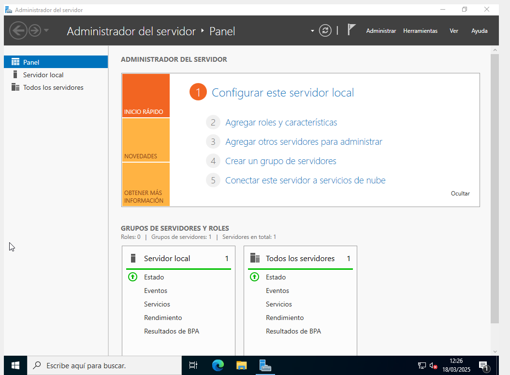

###Windous 10
En el meu cas he triat la versió PRO ja que incorpora més funcionalitats  
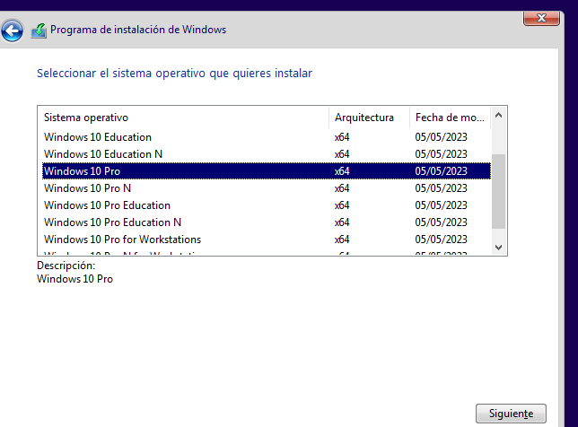  

He fet les particions manualment i he creat una partició sol·licitada per la professora  
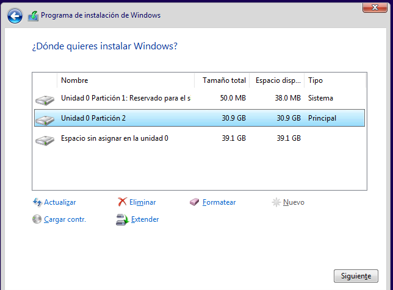

Triaríem un idioma
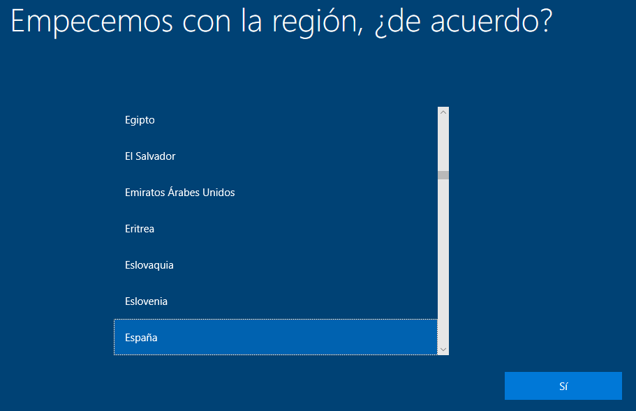

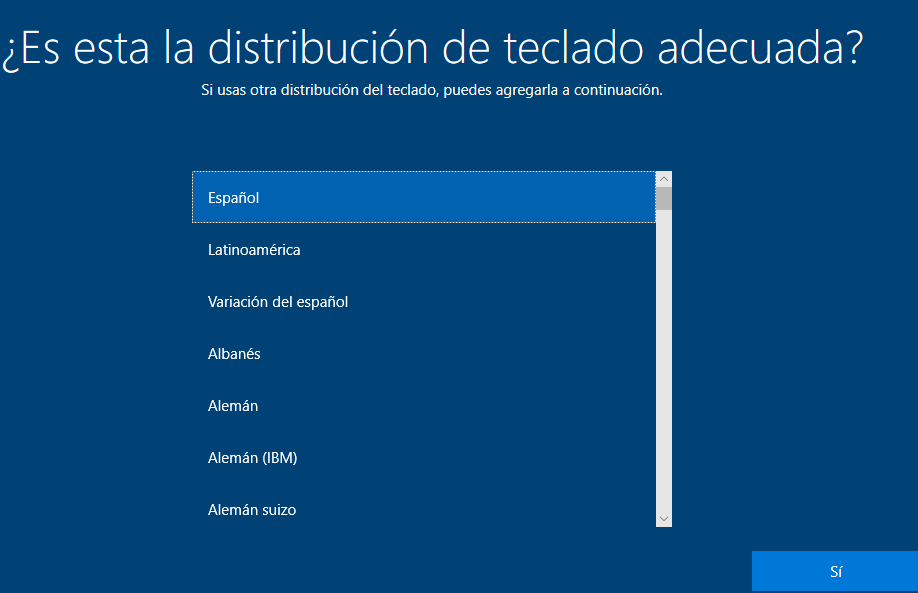

Per finalista configurarem un usuari
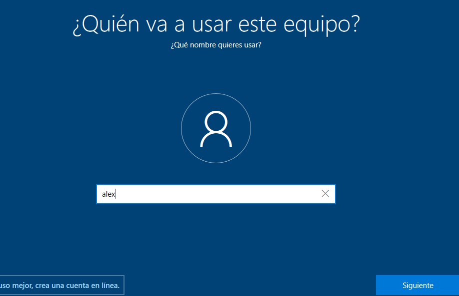

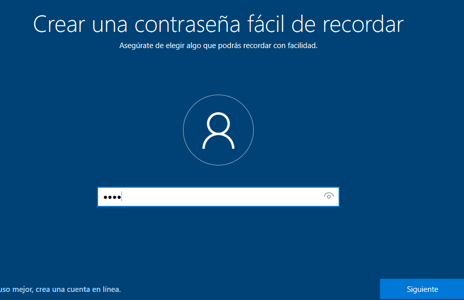  

Comprovació de la partició:
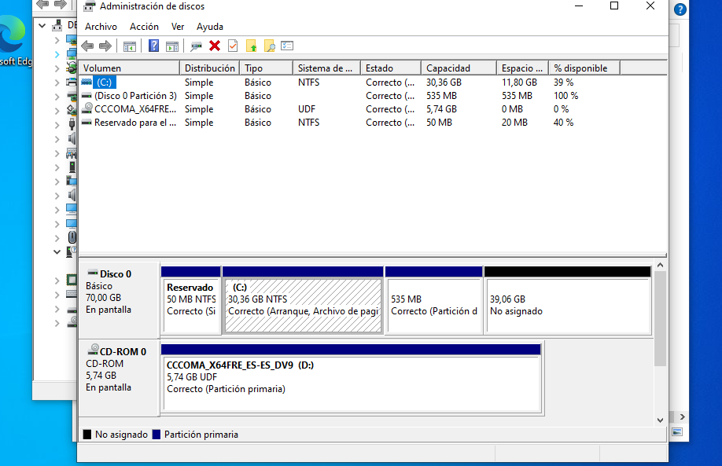  

##Xarxa Basica  
Per a posa un IP fixa obrirem el panel de control i anirem a Rades e internet  
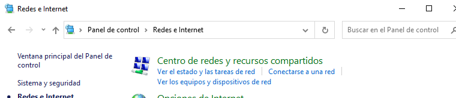  

Anirem a Ethernet  
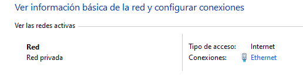  

Propiedades i IPv4  
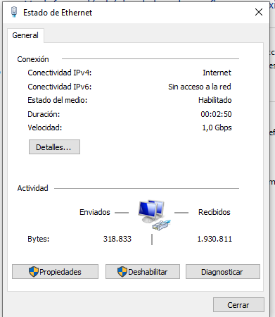

Una vegada dins posaré una IP i DNS estàtic  
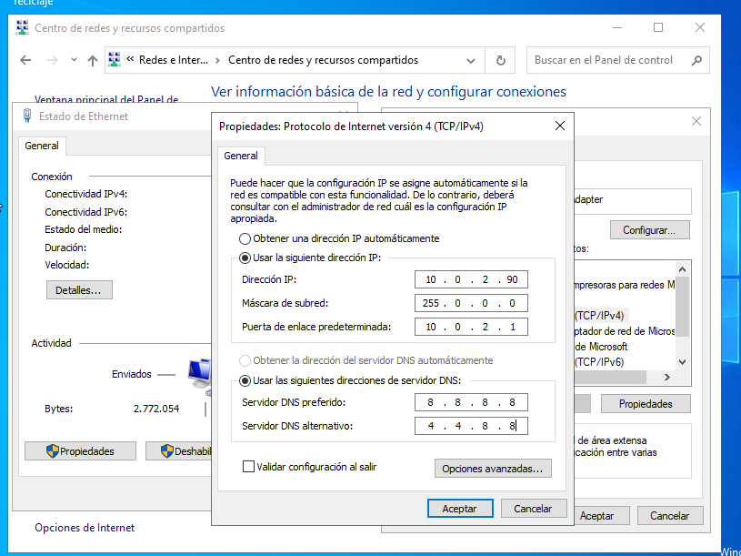

Validacio:  
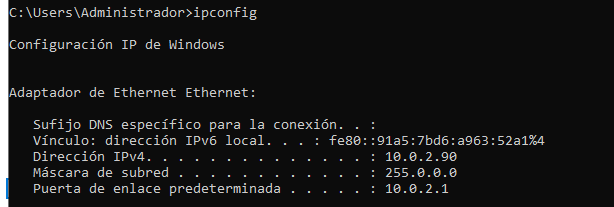

##Instal·lacions d'aplicacions

Farem una instal·lació senzilla a través de la interfície gràfica  

Donarem permisos al instal·lador  
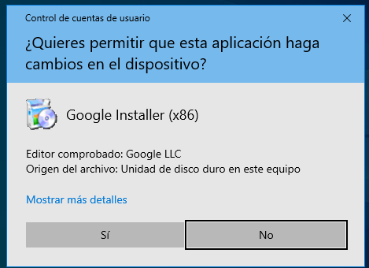

Esperarem a que es complete la descàrrega  
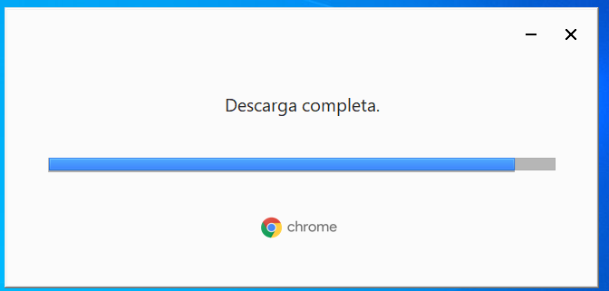

I finalment ja tindrem instal·lat Chrome  
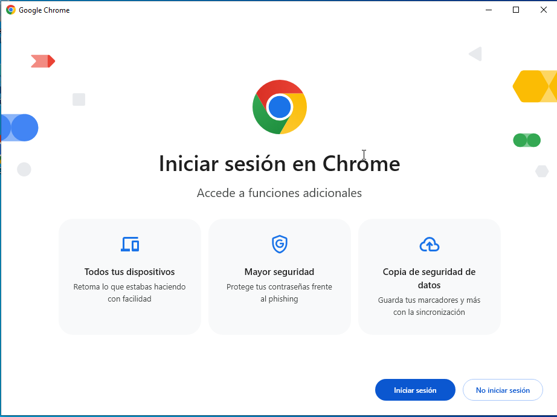

##Copies de seguretat
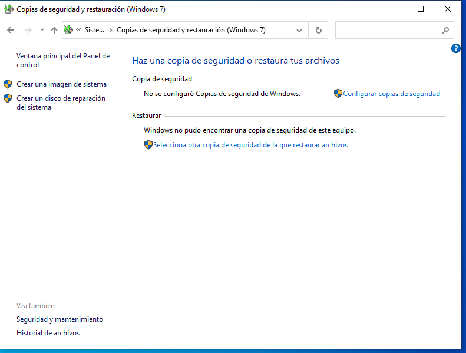

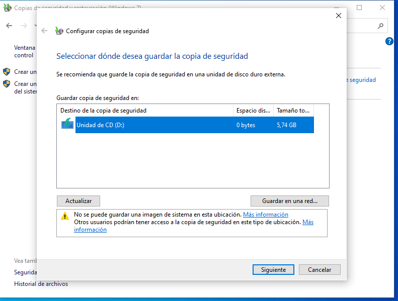

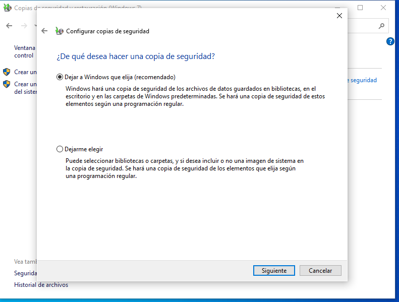

##Dual Boot
GRUB  
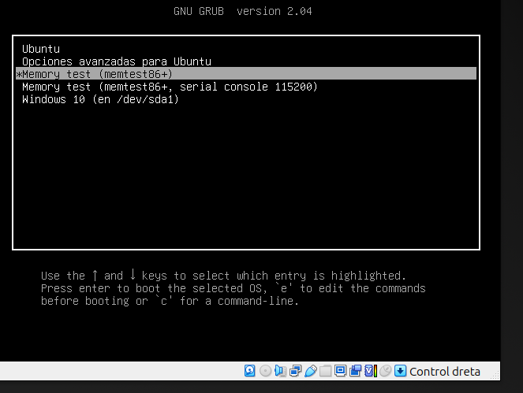

