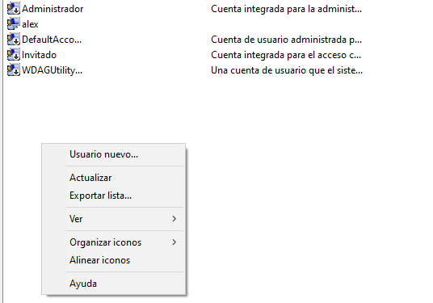

# Sprint6
##Usuaris

Crearem 2 usuaris per interfície usant administracion de equipos

Farem un Usuario nuevo

Li posarem nom i contrasenya

Resultat

Ara crearem el grup Limitats
  

Li posarem els 2 usuaris creats anteriorment

##Script de còpia i automatització

Particio i creacio de volumen NTFS

Li posarem el nom de Backups

Script en bat que copia el contingut de users i el pega al disc E\CopiesUusaris

Resultat

##Gestió de processos i serveis
La comanda tasklist mostra la llista de processos actius al sistema

###Processos no essencials del sistema

Llista de processos que poden ser considerats **no essencials** 

| Nom del procés                    | Memòria usada     | Justificació per eliminar-lo                                       |
|----------------------------------|-------------------|---------------------------------------------------------------------|
| `dwm.exe`                        | 71.572 KB         | Efectes visuals, prescindible en equips amb pocs recursos           |
| `fontdrvhost.exe`      | 3.412 KB          | Gestió de fonts, no essencial si no s’usen fonts especials          |
| `fontdrvhost.exe`      | 4.632 KB          | Idem anterior, duplicat per altra sessió                            |
| `MsMpEng.exe`                    | 280.964 KB        | Escàner en temps real de Windows Defender                           |
| `dllhost.exe`                    | 11.352 KB         | Host de COM, es pot desactivar si no es requereix                   |
| `svchost.exe`         | 62.216 KB         | Pot contenir serveis secundaris                                     |
| `MicrosoftEdgeUpdate.exe`        | 2.528 KB          | Actualitzador de Microsoft Edge, no essencial                       |
| `SgrmBroker.exe`                 | 7.252 KB          | Gestor de seguretat, no essencial en usuaris domèstics              |
| `MoUsoCoreWorker.exe`            | 44.324 KB         | Actualitzacions automàtiques, es pot desactivar temporalment        |
| `SearchIndexer.exe`              | 31.152 KB         | Indexador de fitxers, pot alentir l'equip                           |
| `ctfmon.exe`                     | 20.504 KB         | Entrada de llenguatge, prescindible si no s’usen idiomes alternatius|
| `smartscreen.exe`                | 25.768 KB         | Filtres de seguretat de Windows, es pot desactivar                  |
| `TextInputHost.exe`              | 39.068 KB         | Entrada tàctil o per veu, innecessari en dispositius sense això     |
| `StartMenuExperienceHost.exe`    | 78.388 KB         | Interfície del menú inici, no crític                                |
| `RuntimeBroker.exe`   | 26.296 KB         | Gestor d'autoritzacions, sovint no necessari                        |
| `SearchApp.exe`                  | 88.952 KB         | Cerca de Windows, es pot desactivar                                 |
| `RuntimeBroker.exe`   | 25.452 KB         | Idem anterior, duplicat                                             |
| `ShellExperienceHost.exe`        | 45.344 KB         | Interfície de Windows, no crític                                    |
| `RuntimeBroker.exe`   | 17.132 KB         | Idem anterior, duplicat                                             |
| `msedge.exe`                     | 162.652 KB        | Navegador Edge, es pot tancar si no s’està usant actualment         |

##Gestió de permisos

