# Sprint3
##Instal·lació Domini AD

Una vegada dintre de l'administrador del servidor anirem a afegir rols i característiques   
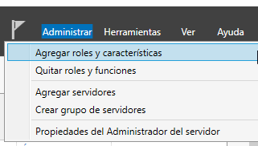

Afegirem controladors de DNS i active directori  
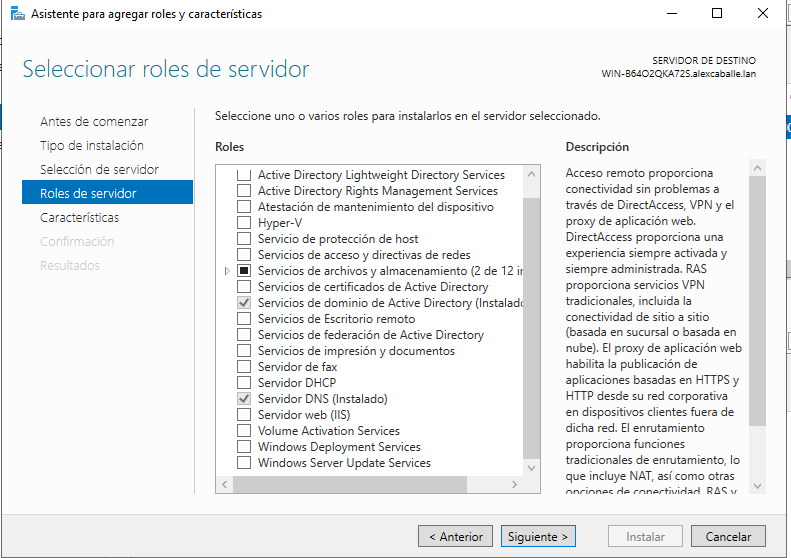

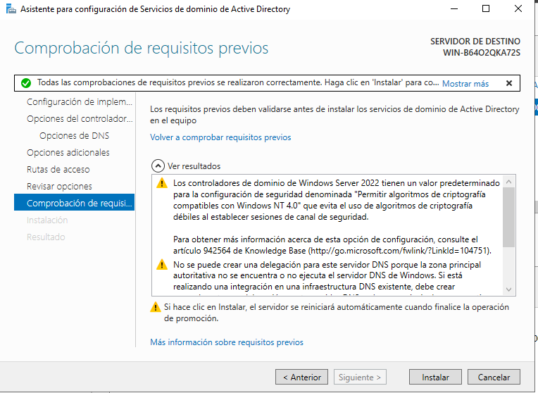

Ens sortirà una notificació de descàrrega  
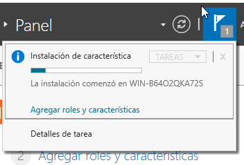

I quan acave una notificacio de configuracio (clicarem)  
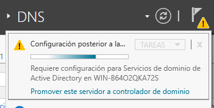

I escomençarem a configurar-lo  
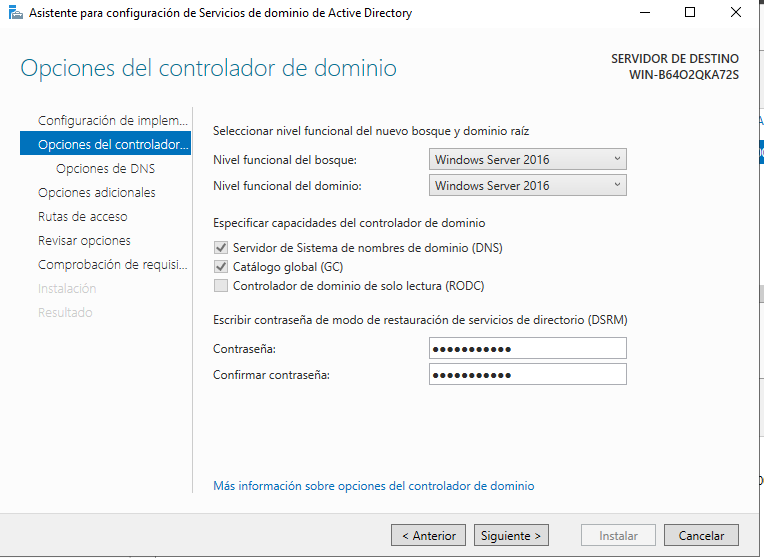

Li posarem nom (important per després)  
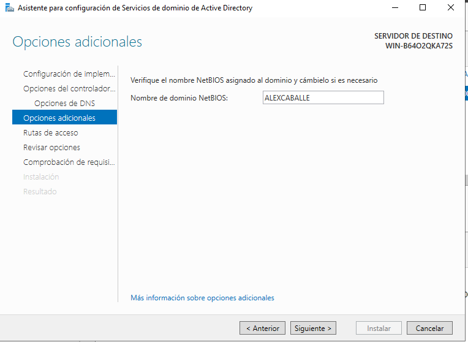

##Unir equips al domini 

Entrarem a un client Windows, configuració i Obtener acceso a trabajo  
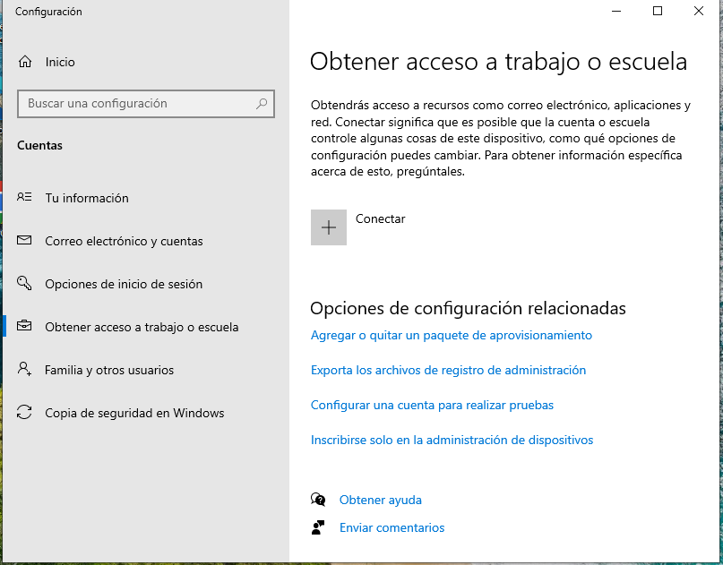

Connectar i unir este dispositivo a un domino AD  
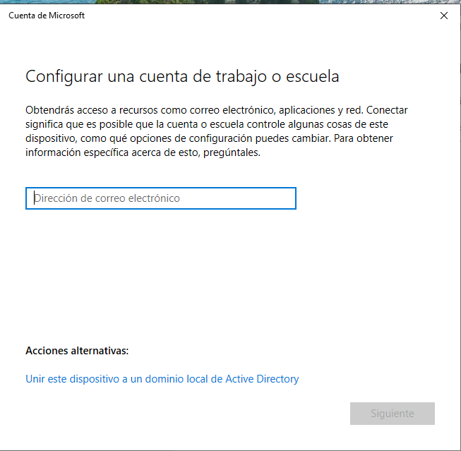

Posarem el no de AD i la extensió seleccionada  

Posarem les credencials de l'usuari creat anteriorment  
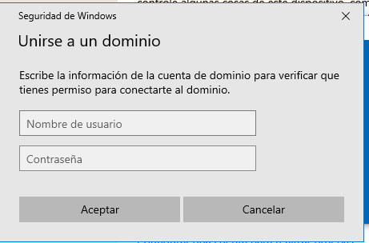

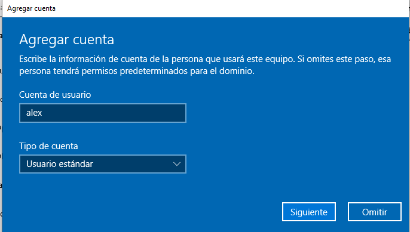

Reiniciarem i finalment i a tindrem accés al servidor AD  
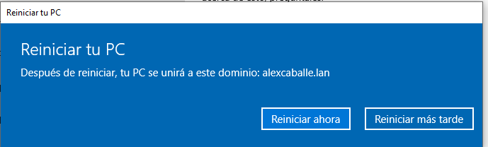

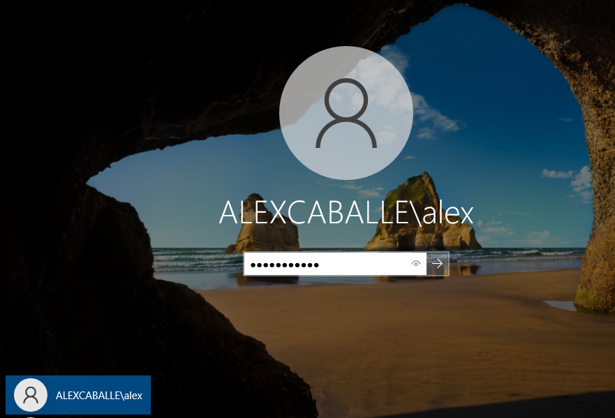

##Gestió del Domini AD

