# Sprint3
##Instal·lació Domini AD

Una vegada dintre de l'administrador del servidor anirem a afegir rols i característiques   

Afegirem controladors de DNS i active directori  

Ens sortirà una notificació de descàrrega  

I quan acave una notificacio de configuracio (clicarem)  

I escomençarem a configurar-lo  

Li posarem nom (important per després)  

##Unir equips al domini 

Entrarem a un client Windows(Pro), configuració i Obtener acceso a trabajo  

Connectar i unir este dispositivo a un domino AD  

Posarem el no de AD i la extensió seleccionada  

Posarem les credencials de l'usuari creat anteriorment  

Reiniciarem i finalment i a tindrem accés al servidor AD  

##Gestió del Domini AD
Creació d'usuari (usat per a prova de connexió)  
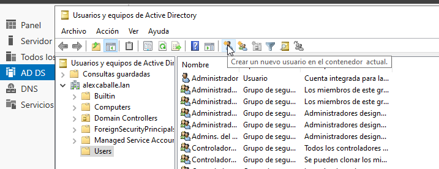

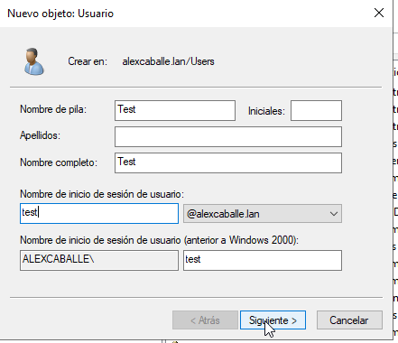

Creació d'unitat organitzativa  
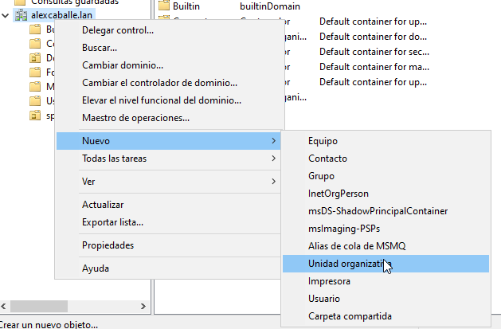

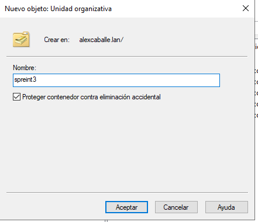

Usuari de la unitat organitzativa  
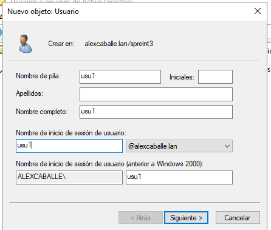

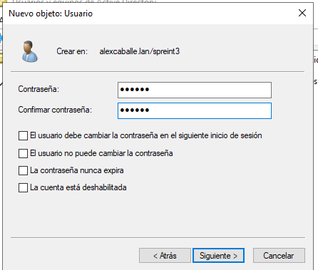

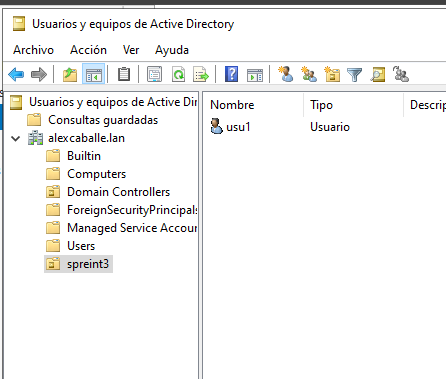

GPOs per a la unitat organitzativa  
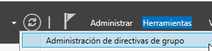

Crearem la promera GPO  
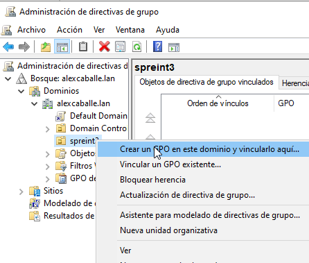

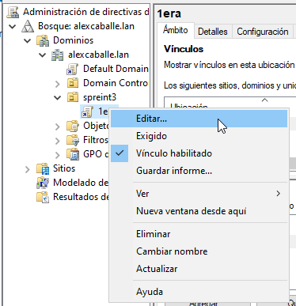

Des de aquí buscarem la directiva que ens interesse  
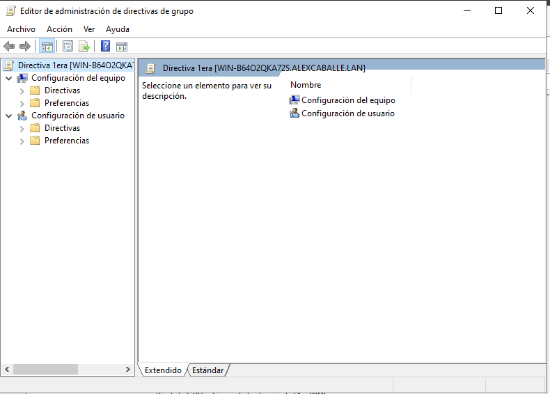

Per exemple que no puguin accedí a configuració ni panel de control  
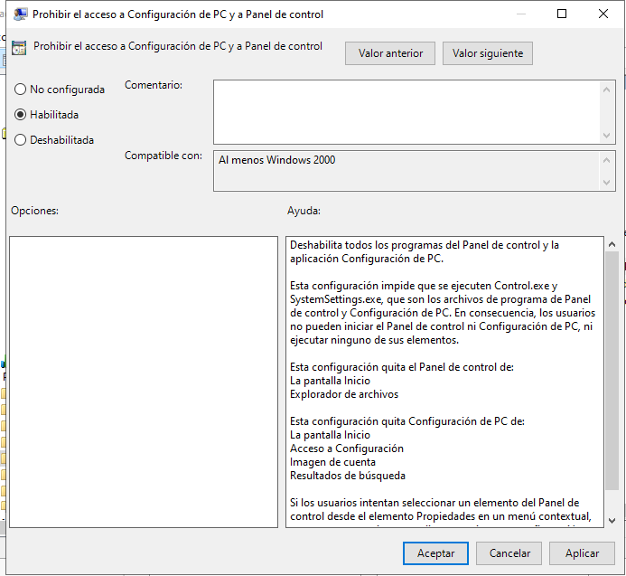

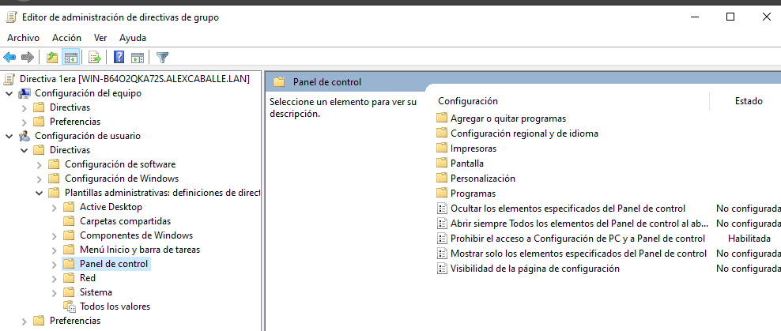

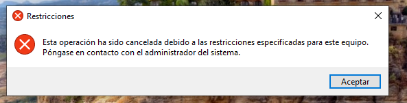

