# Sprint2
## Gparted:
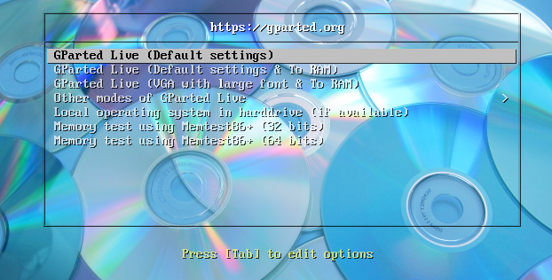

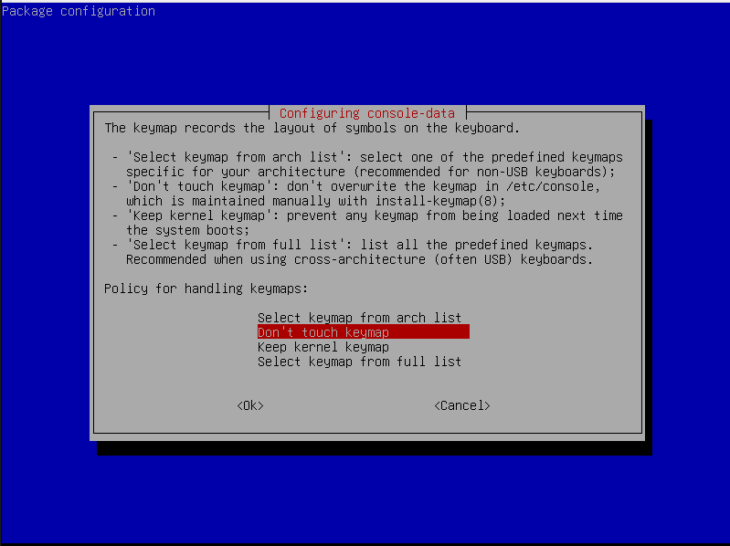

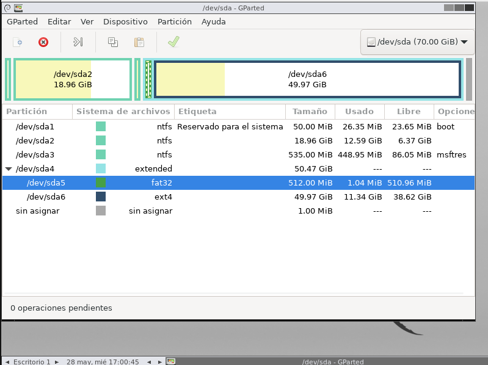

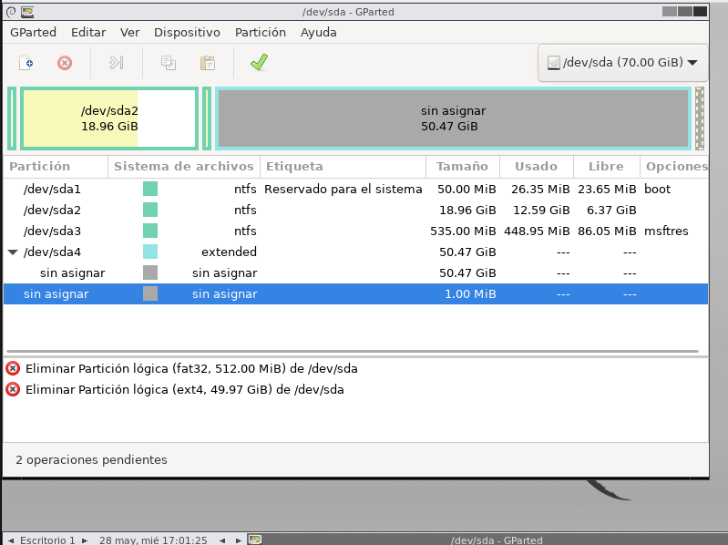

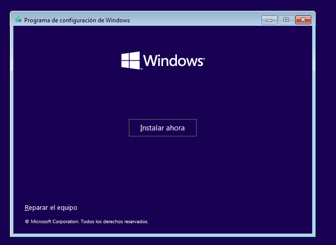

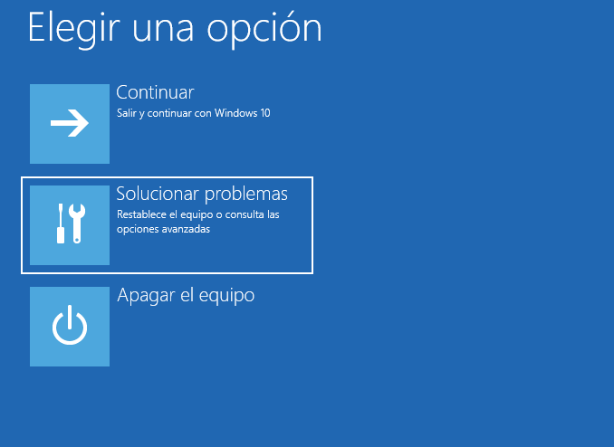

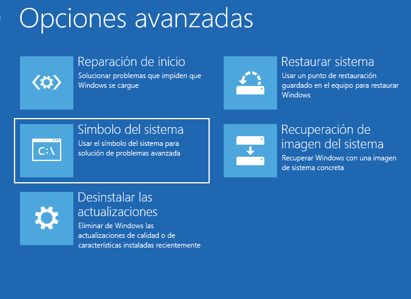

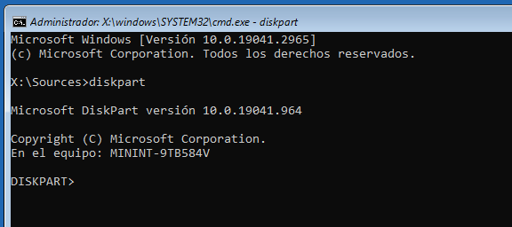

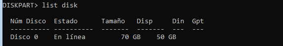

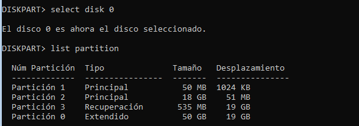

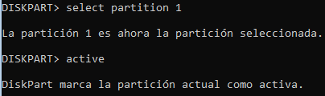

## Llicencies de windius:

### 1. OEM (Original Equipment Manufacturer)
- Associada al maquinari.
- **No es pot transferir** a un altre ordinador.
- Més barata que altres opcions.

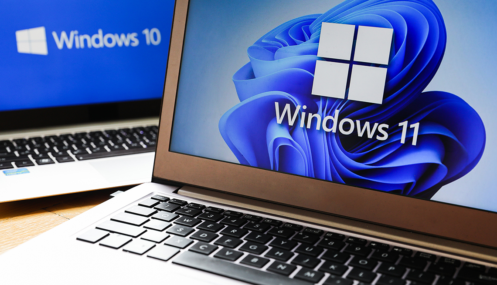

### 2. Retail (al detall)
- Comprada en botigues físiques o digitals .
- **Es pot transferir** a un altre ordinador .
- Té suport directe de Microsoft.

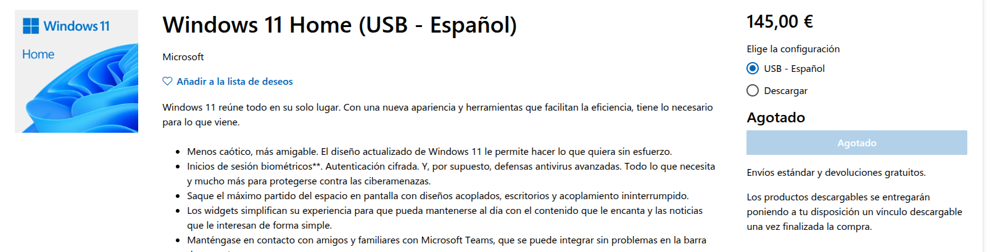

### 3. Volume Licensing
- Per empreses, escoles, institucions.
- Permet instal·lar Windows en múltiples dispositius amb una sola clau.

### 4. Llicència digital 
- Associada al compte Microsoft.
- Es reactiva automàticament si tornes a instal·lar Windows al mateix dispositiu.

# Comparació de llicències de Windows

| Característica              | OEM                     | Retail                  | Volume Licensing        | Llicència Digital         |
|-----------------------------|--------------------------|--------------------------|--------------------------|----------------------------|
| Origen                      | Preinstal·lada           | Botiga o online          | Per a organitzacions     | Vinculada al compte        |
| Transferible a altre PC     | No                       | Sí                       | Sí (segons condicions)   | No                         |
| Preu                        | Més econòmica            | Més cara                 | Variable                 | Inclosa amb el compte      |
| Suport                      | Fabricant del dispositiu | Microsoft                | Responsable IT           | Microsoft                  |
| Activació                   | Clau fixa per dispositiu | Clau de producte         | MAK o KMS                | Automàtica amb el compte   |
| Públic destinatari          | Particulars              | Usuaris generals         | Empreses i institucions  | Qualsevol usuari           |

